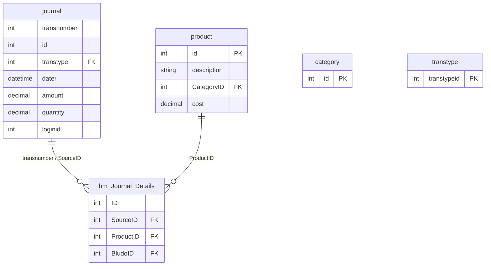

# Продажи

```mermaid
erDiagram
    journal ||--o{ bm_Journal_Details : "transnumber / SourceID"
    product ||--o{ bm_Journal_Details : "ProductID"

    journal {
        int transnumber
        int id
        int transtype FK
        datetime dater
        decimal amount
        decimal quantity
        int loginid
    }

    bm_Journal_Details {
        int ID
        int SourceID FK
        int ProductID FK
        int BludoID FK
    }

    product {
        int id PK
        string description
        int CategoryID FK
        decimal cost
    }

    category {
        int id PK
    }

    transtype {
        int transtypeid PK
    }
```
