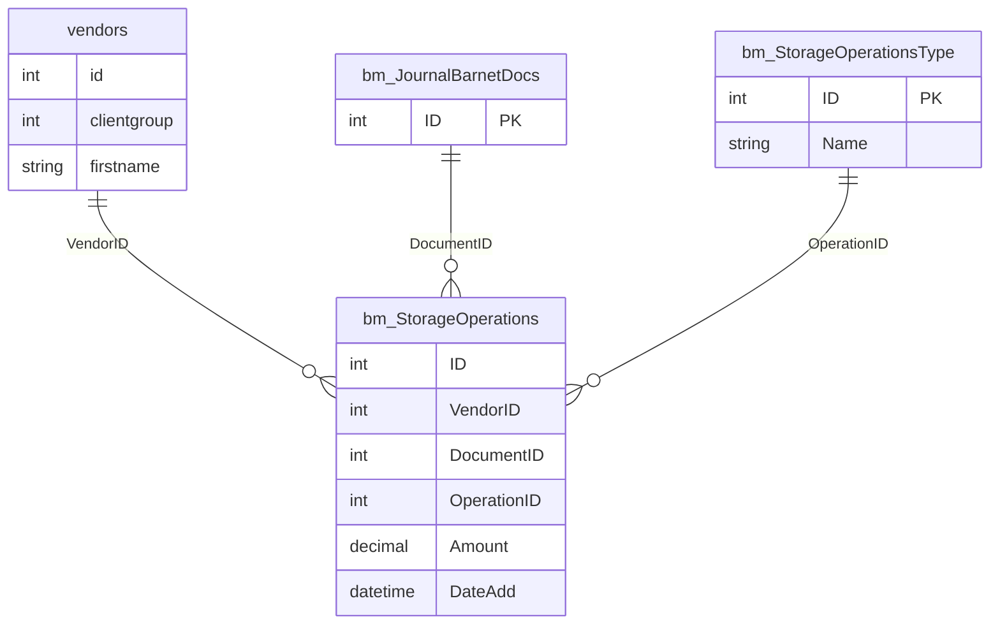

# Анализ поставщиков

```mermaid
erDiagram
    vendors ||--o{ bm_StorageOperations : "VendorID"
    bm_JournalBarnetDocs ||--o{ bm_StorageOperations : "DocumentID"
    bm_StorageOperationsType ||--o{ bm_StorageOperations : "OperationID"

    vendors {
        int id
        int clientgroup
        string firstname
    }

    bm_StorageOperations {
        int ID
        int VendorID
        int DocumentID
        int OperationID
        decimal Amount
        datetime DateAdd
    }

    bm_JournalBarnetDocs {
        int ID PK
    }

    bm_StorageOperationsType {
        int ID PK
        string Name
    }
```
