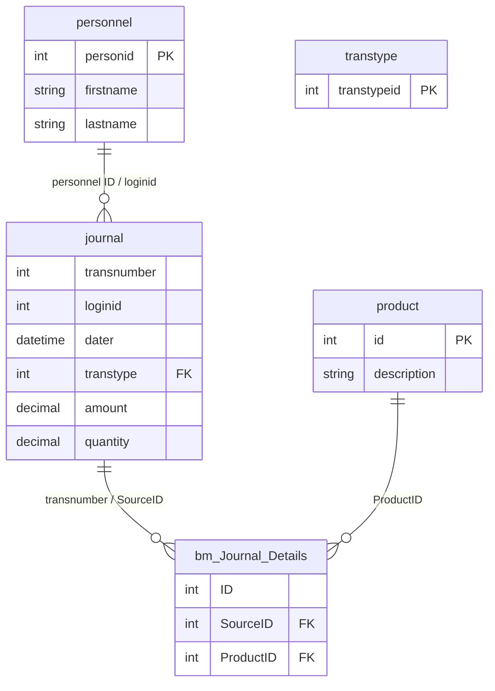

# Анализ работы персонала

```mermaid
erDiagram
    personnel ||--o{ journal : "personnel ID / loginid"
    journal ||--o{ bm_Journal_Details : "transnumber / SourceID"
    product ||--o{ bm_Journal_Details : "ProductID"

    personnel {
        int personid PK
        string firstname
        string lastname
    }

    journal {
        int transnumber
        int loginid
        datetime dater
        int transtype FK
        decimal amount
        decimal quantity
    }

    bm_Journal_Details {
        int ID
        int SourceID FK
        int ProductID FK
    }

    product {
        int id PK
        string description
    }

    transtype {
        int transtypeid PK
    }
```
