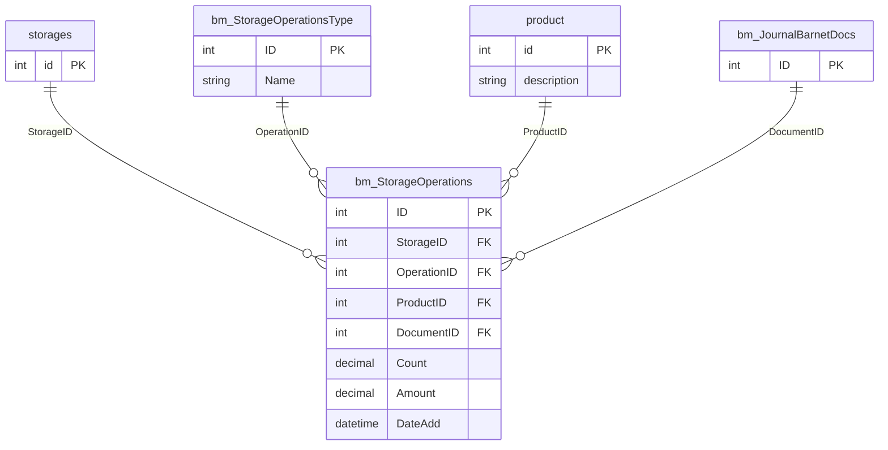

# Анализ складских запасов

```mermaid id="m9z2ka"
erDiagram
    storages ||--o{ bm_StorageOperations : "StorageID"
    bm_StorageOperationsType ||--o{ bm_StorageOperations : "OperationID"
    product ||--o{ bm_StorageOperations : "ProductID"
    bm_JournalBarnetDocs ||--o{ bm_StorageOperations : "DocumentID"

    storages {
        int id PK
    }

    bm_StorageOperations {
        int ID PK
        int StorageID FK
        int OperationID FK
        int ProductID FK
        int DocumentID FK
        decimal Count
        decimal Amount
        datetime DateAdd
    }

    bm_StorageOperationsType {
        int ID PK
        string Name
    }

    product {
        int id PK
        string description
    }

    bm_JournalBarnetDocs {
        int ID PK
    }
```
